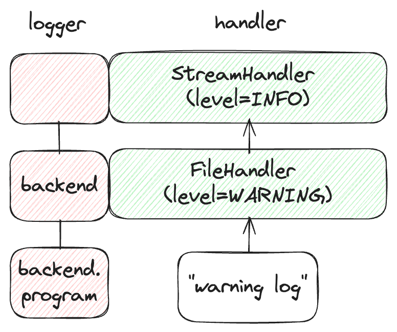

## logging이란 무엇이고 왜 필요한가?

---

파이썬을 처음 배웠을 때 썼던 `print("Hello World!")`. 이 이후로 꽤 오랫동안 제 로깅은 `print`에만 머물러 있었습니다.

프로그램을 만들 때 디버깅을 위해 수많은 `print`문을 집어 넣었다가, 어느 정도 완성이 되었을 때 `print` 문을 전부 주석 처리하고,
또 다시 에러가 터졌을 때 다시 `print`문을 만들고...
이 비효율적인 굴레를 아무렇지 않게 계속 돌고 있었습니다.

이 문제를 우아하게 해결하는 방법 중 하나가 logging 시스템을 활용하는 것입니다.
logging 시스템의 가장 큰 장점은, 로깅하고 싶은 메시지를 그 중요도에 따라 구분하고, 상황에 따라 일정 수준 이상의 중요도를 가지는 로그만
출력할 수 있다는 점입니다. 다음과 같이 `print` 문을 썼다 지웠다 하는 코드를 살펴보고,
logging을 사용하는 동일한 코드를 살펴보면 그 필요성을 실감할 수 있습니다.

```python
print("Start program")
while True:
    user_input = input("Enter int: ")
    print(f"user input before int type cast: {user_input}")
    try:
        user_input = int(user_input)
    except ValueError:
        print(f"Given input {user_input} is not an integer. Try again...")
        continue
    break
print(f"user input: {user_input}")
print("Exit program")
```

`print`로만 메시지(로그)를 출력하는 프로그램은 중요도에 따라 로그 레벨을 조절할 수 없어 따로 `print`를 주석 처리 또는
삭제하지 않는 이상 모든 로그가 전부 출력될 것입니다. 이제 이 코드를 python `logging` 모듈로 바꾼 동일한 코드를 살펴보겠습니다.

```python
import logging

logging.debug("Start program")
while True:
    user_input = input("Enter int: ")
    logging.debug(f"user input before int type cast: {user_input}")
    try:
        user_input = int(user_input)
    except ValueError:
        logging.warning(f"Given input {user_input} is not an integer. Try again...")
        continue
    break
logging.info(f"user input: {user_input}")
logging.debug("Exit program")
```

위와 같이 `print`만을 쓰던 코드를 logging을 사용하는 코드로 변환하면 정보의 중요도에 따라 로그를 선별적으로 출력할 수 있습니다.
예를 들어, 프로그래밍을 완료한 후에는 프로그램이 방금 시작했다거나, 연산 수행 전 인풋 값을 굳이 확인할 필요가 없고,
무언가 살펴볼 만한 사건이 생겼을 때 (유저가 유효하지 않은 형식의 인풋을 넣은 경우)만 해당 사건을 확인하고 싶은 경우가 많습니다.

또한 단지 로그를 화면 (stdout, stderr)에만 찍는 것뿐만 아니라 화면에 로그를 찍는 동시에 
`program.log`와 같은 로그 파일에 로그를 저장하고 싶을 수도 있고, 이때 파일에 찍는 로그는 좀 더 낮은 중요도를 가진 로그도 포함시키고
싶을 때도 있습니다.

이렇듯 `print`만을 써서는 달성할 수 없는 로그 관리를 logging을 통해 할 수 있고, 그 중에서도 파이썬에서 기본으로
제공하는 [python logging 모듈](https://docs.python.org/3.11/library/logging.html)은 이러한 기능들을 이미 잘 구현해 제공하고 있습니다.

이 글에서는 파이썬 공식 logging 모듈인 logging 모듈의 기능과 약간의 내부 구조를 소개하고, logging 모듈을 채용하기 좋은 
두가지 상황(멀티 모듈 파이썬 프로젝트에서의 로깅 워크 플로우와 주피터 노트북에서의 로깅 워크 플로우)을 소개하겠습니다.

그렇기에 logging을 처음 접하시는 분들이나, 이미 logging을 사용하고 있지만 가끔 로그가 잘 안 보이거나 멀티 모듈 프로젝트에서 logging을 
어떻게 셋업해야 할 지 궁금증을 가지신 분들 모두가 조금이라도 얻어갈 수 있는 글이 되었으면 좋겠습니다.

> 이 글에 제시된 logging 워크 플로우는 가능한 수많은 방식 중 하나에 불과합니다. 더 좋은 방법을 아신다면 댓글로 언제든지 소개해주세요!
{: .prompt-warning}


## 로컬 작업 환경

---
+ macOS Sonoma 14.2.1
+ OSX arm64 (Apple Silicon)
+ zshell
+ 2024년 4월 기준 작동하는 것 확인

> logging 라이브러리는 파이썬 기본 라이브러리이기 때문에 별도의 설치 없이 `import logging`으로 바로 사용 가능합니다.
{: .prompt-info}

## Logging 모듈 핵심 개념

---

Python logging 라이브러리는 다양한 오브젝트를 포함하고 있고, 단순히 `print` 할 때와는 달리 여러 내부 객체와 메서드의
상호작용을 통해 최종적으로 어디에, 얼마나, 어떻게 로깅을 할 지 결정해야 합니다. 그렇기에 logging 라이브러리를 잘 이해하기 위해서는
logging 라이브러리의 핵심 객체들의 기능과 상호작용을 이해해야 합니다.

> 이 글은 고급 로깅 가이드가 아닌 소개로, 이외의 수많은 logging 모듈 속 객체와 함수에 대한 글은 
> [공식 문서 속 advanced tutorial](https://docs.python.org/3.11/howto/logging.html#logging-advanced-tutorial)을 참고해주세요.
{: .prompt-warning}

### Logger

Logging 모듈의 가장 핵심적인 클래스는 단연 `logging.Logger`입니다. 말 그대로 log를 찍는 객체이며, 다음과 같은 함수로 새로운 
`Logger` 객체를 만들거나, 이미 만들어졌다면 그 객체를 불러올 수 있습니다.
참고로 logging 모듈은 `logging.Logger` 객체를 `logger = Logger()`와 같이 직접적으로
초기화 하지 말고 `logging.getLogger()` 함수를 사용하라고 안내합니다.

```python
import logging

logger = logging.getLogger("name of logger here")
```

- `Logger.level`: 해당 logger가 로깅할 최소 수준의 중요도 등급을 의미합니다. 이 수준 이하의 로그는
이 로거에게 무시되며, logging 모듈의 대표적인 레벨은 다음과 같습니다.
예를 들어, 로거의 레벨이 `logging.WARNING`오로 설정되어 있다면 `logger.debug()`와 `logger.info()`와 같이 로그된 로그는
이 로거에겐 무시되는 것입니다. 로거의 레벨은 `logger.setLevel()` 메서드로 지정할 수 있습니다.

> 한가지 유의할 사실은, 이 level이 logger에만 있는 성질이 아니라는 점입니다. 아래에도 서술하겠지만 handler에도 level을
> 설정할 수 있습니다. 
{: .prompt-warning}

| level            | 의미                                        |
|------------------|-------------------------------------------|
| logging.NOTSET   | 따로 logger의 레벨을 지정하지 않으면 설정되는 레벨로, 추후 설명   |
| logging.DEBUG    | 개발자가 디버깅할 때만 필요한 세부적인 정보                  |
| logging.INFO     | 프로그램이 예상대로 동작함을 보여주는 정보                   |
| logging.WARNING  | 프로그램이 예상대로 동작하지만, 추후 문제가 있을 수도 있다는 것을 보여주는 정보 |
| logging.ERROR    | 프로그램이 예상대로 동작하지 않고,문제가 생겼음을 보여주는 정보       |
| logging.CRITICAL | 프로그램에 심각한 문제가 생겼음을 나타내는 정보                |

- `Logger.name`: `logging.getLogger`로 생성하거나 들고 온 Logger 객체의 이름이며, 단지
어떤 logger의 이름을 지칭하는 것을 넘어서 기능 상으로도 매우 중요한 의미를 지닙니다.
우선 동일한 이름을 가진 logger는 하나만 존재할 수 있고, logger에 이름에 따라 logger끼리 다음과 같은 상속 관계를 가집니다.
상속 관계는 `.`으로 연결되며, `.`으로 연결된 단위마다 한 단계 자식 로거라고 생각할 수 있습니다.
다음 그림을 보면 더 쉽게 이해할 수 있습니다.


상속 단위 최상단에 위치한 루트 로거(root logger)는 `logging.getLogger()`와 같이 아무 이름이 없는 로거를 의미합니다. 
(실제 이름을 찍어보면 'root'지만 모든 로거의 부모가 되어야 하기 때문에 빈 문자열로 불러올 수 있습니다.)
`compute`와 `app`, `__main__`이라는 이름을 가진 로거들은 루트 로거의 자식이고(맨 앞에 가상의 `.`이 있다고 생각하면 이해하기 편합니다),
`compute.stat`과 `compute.test`는 `compute`의 자식 로거, `app.input`은 `app` 로거의 자식 로거입니다.

> 이러한 로거의 이름에 따른 계층적 상속 개념은 이후에도 정말 중요하게 활용되니 꼭 기억해주세요!
> {: .prompt-info}

- `Logger.propagate`: 바로 뒤에 설명하겠지만, 모든 로거는 각자 임의의 수의 Handler를 가지고 있을 수 있습니다.
위의 예시에서 compute 로거도 handler를 n(>=0)개 가지고 있을 수 있고, 루트 로거도 마찬가지입니다.
이때 logger.propagate는 어떤 로거가 받은 로그를 자신의 부모 로그에게 전달할지 여부를 의미합니다.
기본적으로는 `True`로 설정되며, `True`로 설정될 경우 자식 로거의 로그는 자식 로거의 핸들러 뿐만 아니라 부모의 핸들러에게도
전달이 됩니다.

이때 자식 로거의 핸들러와 부모 로거의 핸들러 모두 이 로그를 출력하기로 했다면 같은 메시지가 두 번 이상 출력될 수도 있습니다.
하지만 보통은 루트 로거에만 핸들러를 설정하는 경우가 대부분이라, 자식 로거들에서는 `logger.propagate=True`로 로그를 모두 루트 로거의
핸들러에게 맡기는 것이 일반적입니다.


### logging.Handler

`logging.Handler`는 `logging.Logger`에 종속되는 개념으로, 하나의 로거는 0개 이상의 핸들러를 가질 수 있습니다.
핸들러란 로그가 들어왔을 때 그것을 출력할지의 여부와, 출력한다면 어디로 출력할지를 결정하는 모듈로, 터미널 상에 로그를 출력하는
`StreamHandler`와 `app.log`와 같은 파일에 로그를 쓰는 `FileHandler`가 일반적으로 많이 쓰입니다. 이 외에도 다양한
핸들러가 존재하며, 유저가 필요에 따라 커스텀 핸들러를 구현해 사용할 수도 있습니다.

이때 중요한 것은, 로거와 마찬가지로 개별 핸들러에 대해서도 level 설정이 가능합니다.

예를 들어 하나의 로거에 대해 WARNING 이상의 로그는 터미널로, INFO 이상의 로그는 `app.log` 파일에 저장하고 싶다면,
`StreamHandler`를 정의해 레벨을 WARNING으로 설정하고, `FileHandler`를 정의해 레벨을 INFO로 설정해 한 로거에
`logger.addHander(...)` 와 같이 추가해주면 됩니다.

### logging.Formatter

`logging.Formatter`는 문자열에 불과한 `"start program"`과 같은 로그 메시지를
`2024-03-26 20:11:23,203 - module1 - INFO - start program`과 같이 포매팅을 해주는 모듈입니다.
다음과 같이 초기화 및 형식 설정이 가능합니다.
```
formatter = logging.Formatter('%(asctime)s - %(name)s - %(levelname)s - %(message)s')
```

한가지 유의할 점은 포매터는 바로 logger에 달 수 있는 것이 아니라 handler에 달아야 한다는 점입니다. 로거는 로그를 받고 `LogRecord`라는
객체를 만드는 역할을 담당하고, 실제 각 출력 위치 (터미널, 파일 등)에 직접 연결되어 출력을 담당하는 것은 핸들러이기에 포매터가 핸들러에 달리는 것이
디자인적으로 더 자연스럽긴 하지만, 처음에는 계속 헷갈리는 개념입니다.

### logging.Filter

`logging.Filter` 는 말 그대로 특정한 조건에 따라 로그를 필터링하는 모듈입니다. logger와 handler 둘 다 부착 가능하며, 앞서 소개한
세 모듈에 비해 적어도 제 워크플로우에선 자주 쓰이진 않습니다. 특정한 이름의 로거에서 온 로그만 로깅하고 싶은 경우 사용할 수 있습니다.
가령 위 예시에서 `"compute.test"`를 루트 로거의 Filter로 건다면 `compute.test`와 `compute.test.inner`에서 온 로그만
통과시킬 수 있습니다.

### 핵심 객체들의 관계

지금까지 logging 모듈의 핵심 객체들을 소개했습니다. 각 객체에서 간단히 설명하긴 했지만, 핵심 객체 간의 관계를 파악하는 것이
로깅 시스템을 파악하는데 중요합니다. 다음 관계를 곱씹으면서 글을 읽어나가시면 좋을 것 같습니다.

1. 여러 개의 로거들은 이름에 따라 상속 관계를 가집니다.
2. 하나의 로거는 0개 이상의 핸들러를 가질 수 있습니다
3. 하나의 로거는 0개 이상의 필터를 가질 수 있습니다.
4. 하나의 핸들러는 하나의 포매터를 가질 수 있습니다.
5. `logging.level`은 로거와 핸들러 모두 설정할 수 있습니다.


## 왜 내 logging은 안 보일까?

logging을 드디어 내 코드에 사용하기 위해 `print`를 `logger.info()`와 같이 바꾸어 코드를 실행해본 경험이 있다면,
다음과 같이 로그를 분명히 출력했음에도 어디에서도 보이지 않는 경험을 해보았을 것입니다.

```python
import logging

logger = logging.getLogger(__name__)
logger.info("I want to log something")  # this will not work :(
```

야심차게 logging을 내 코드에 도입했고, 심지어 logging 문서에서 하라는대로 `getLogger(__name__)`으로 루트 로거가 아닌
해당 모듈의 이름을 로거의 이름으로 설정해 생성했습니다. 하지만 아무 것도 보이지 않습니다. 무엇이 잘못 되었을까요?

### 하나의 로그가 출력 되기까지의 여정

조금 번거롭긴 하지만 어차피 계속 써야 하는데 찜찜한 부분 없이 이번에 제대로 이해하기 위해서는 하나의 로그가 `logger.info("message")`
처럼 생성 되었을 때 그것이 실제 터미널이나 파일등의 목적지에 출력되기까지의 여정을 이해할 필요가 있습니다.

설명의 편의를 위해 필터는 없다고 가정하고 설명을 진행하겠습니다. 필터가 없다는 것은 필터로 인해 막히는 메시지가 없다는 뜻입니다.
또한 이 로그의 level은 INFO라고 가정하겠습니다.


1. 위와 같이 하나의 메시지가 `logger.info()`와 같이 불리면 우선 logger의 설정 레벨에 따라 이 로그를 무시할지 여부를 결정합니다.
이 로거에 설정된 레벨이 INFO보다 작거나 같다면, 이를 통과시키고 LogRecord 객체를 생성합니다. LogRecord는 로그 메시지와 같지만 단순 
문자열과 달리 logging의 다양한 객체가 주고 받기에 편한 객체 (더 구체적으로는 DTO지만 이것이 무엇인지 알 필요는 없습니다) 라고 생각할 수 있습니다. 
2. 해당 로거의 handler들에게 LogRecord를 넘겨줍니다. 지금부터는 우측 상단의 handler flow로 진행이 됩니다.
3. 해당 핸들러의 설정 레벨에 따라 이 LogRecord를 무시할지 여부를 결정합니다. 마찬가지로 이 핸들러에 설정된 레벨이 INFO보다 작거나 같아야
이 로그를 통과시킵니다. 그리고 각 핸들러의 출력 방법으로 LogRecord를 출력(emit)합니다. 이 핸들러의 작업은 여기서 끝이 납니다.
4. 해당 로거에 소속된 다른 핸들러가 있다면 (3)의 과정을 반복합니다.
5. 해당 로거의 `logger.propagate=True` 인지 확인하고, `True`로 설정된 경우 현재 로거를 부모 로거로 바꿔
루트 로거까지 도달하거나, propagate가 끊기거나, 해당 로거의 level을 통과하지 못할 때까지 (2) 과정을 수행합니다.

여기까지 보았다면 logging 모듈의 기본적인 메커니즘은 거의 다 이해했다고 할 수 있습니다. 그렇다면 위에 잘 안 되던 예시를 고쳐
정상적으로 로그를 출력하는 예시로 바꿔 보면서 무엇이 빠져있는지 살펴보겠습니다.

```python
import logging

logging.basicConfig(level=logging.INFO)
logger = logging.getLogger(__name__)
logger.info("I want to log something")  # this will work! :)

# Output:
# INFO:__main__:I want to log something
```

`logging.basicConfig(level=logging.INFO)` 한 줄을 추가했을 뿐인데, 이제 로그가 예상한대로 출력됩니다.
하지만 이 한 줄의 추가로 인해 내부적으로 달라진 점은 그렇게 단순하지 않습니다.

먼저 다음과 같은 사실을 알 필요가 있습니다.
1. `logging.basicConfig` 함수는 특정 로거가 아니라 루트 로거의 특성을 설정하는 함수입니다.
더 정확하게는, `logging.basicConfig()` 가 불리면
기본 StreamHandler에 기본 Formatter를 붙이고, 이 핸들러를 루트 로거에 달아줍니다.
2. 아무 것도 하지 않았을 때 (`logging.basicConfig`를 부르지 않았을 때) 루트 로거의 level은 `WARNING`이고, 아무런 핸들러가 달려있지 않습니다.
3. 해당 코드를 file.py에 넣고 이 파일을 entrypoint 삼아 `python file.py`와 같이 실행하면
`__name__` 은 자동으로 `__main__`으로 설정됩니다. `file`이 아니라 왜 `__main__`이 되는지는 이 글의 주제가 아니기 때문에 넘어가겠습니다.

그리고 기존 코드의 문제를 살펴보겠습니다. `logging.getLogger`만 한 상태로 로거를 정의하면, 이 로거의 이름은 `__main__`이 됩니다.
루트 로거가 아닌, `__main__`이라는 이름의 로거라는 점이 중요합니다. 이 로거 또한 핸들러가 아무것도 달려있지 않습니다.

또한 `__main__`이라는 이름의 로거의 레벨도 설정하지 않았습니다. 이때의 레벨은 `logging.level.NOTSET`이 되며, `NOTSET` 레벨은
`DEBUG` 레벨보다도 낮은 레벨이기 때문에 `INFO` 레벨인 메시지는 통과시킵니다.

이제 `logging.basicConfig`를 포함시킨, "I want to log something"이라는 로그가 잘 출력 되기까지의 여정을 따라가 보겠습니다.

`logging.basicConfig(level=logging.INFO)`를 부름으로써 바뀐 것은 두가지 입니다.

1. 루트 로거의 level이 `WARNING`(기본)에서 `INFO`가 되었습니다.
2. 루트 로거의 handler가 없었다가, 기본 Formatter가 달린 StreamHandler가 되었습니다. 이 핸들러의 level을 따로 정하지 않았기 때문에
이 핸들러의 level은 `NOTSET`이 되어 모든 메시지를 통과시킵니다.

| stage | logger name | 설명                                                                                                                                            |
|-------|-------------|-----------------------------------------------------------------------------------------------------------------------------------------------|
| 1     | `__main__`  | `__main__`이라는 이름의 로거의 레벨이 `NOTSET`이므로 이 로그에 해당되는 LogRecord를 만들어 다음 단계로 보냅니다.                                                                  |
| 2~4   | `__main__`  | 이 로거는 핸들러가 없기 때문에 그대로 넘어갑니다.                                                                                                                  |
| 5     | `__main__`  | 처음 로거를 만들 때 아무 설정도 하지 않았기 때문에 propagate=True입니다. 그렇기에 "__main__" 로거의 부모인 루트 로거에게 LogRecord를 넘깁니다. 즉 __main__" 로거 단계에서는 그 어떠한 로그도 출력되지 않습니다.   |
| 1     | `root`      | 루트 로거의 level을 `INFO`로 설정해주었음으로 해당 LogRecord를 다음 단계로 보냅니다.                                                                                     |
| 2~4   | `root`      | 루트 로거에는 기본 포매터가 달린 기본 StreamlHandler가 핸들러로 존재합니다. 이 핸들러의 레벨이 `NOTSET`이기 때문에 `INFO` 레벨의 해당 LogRecord는 `sys.stderr`로 출력됩니다.                     |
| 5     | `root`      | 루트 로거에 도달했고 더 이상의 핸들러가 없기 때문에 종료합니다.                                                                                                          |


이와 같은 과정을 통해, `logging.basicConfig(level=logging.INFO)`라는 단 한 줄이 추가되었을 때 의도한대로 `INFO` 레벨의 로그가 출력되는
것을 살펴 보았습니다. 코드에는 거의 차이가 없지만, 내부적으로 동작하는 방식은 큰 차이가 있었습니다.


### 심화: 루트 로거에도 아무 핸들러가 없을 때

---

이쯤에서 한 가지 궁금증이 생길 수 있습니다. `logging.basicConfig(level=logging.INFO)`와 같이 루트 로거에 핸들러를 달아주거나
명시적으로 루트 로거에 아무 핸들러를 달아주지 않는다면, 이 루트 로거는 아무것도 로깅할 수 없는 것일까요?

처음에는 그럴 것이라고 생각했습니다. 실질적인 로그 출력은 핸들러가 담당하는데, 루트 로거에조차 아무런 핸들러가 없다면 로깅 시스템으로는
아무런 로그도 출력하지 못하는 것이 이론적으로는 맞습니다. 하지만 `logger.error`나 `logger.critical`과 같은 정말 중요한 로그를
찍었는데 실수로 핸들러를 설정하지 않아 아무것도 출력되지 않는다면 그것도 그것대로 문제가 있는 셋업이라고 생각합니다.

로거와 핸들러의 관계를 이해하고 핸들러를 설정하는 것을 몰라도 정말 중요한 로그는 아무렇게나 찍어도 출력되게끔 하는 것이 초보자나
급하게 logging을 도입한 유저의 편의를 지키는 것일 겁니다.

위 맥락은 제 추론이긴 하지만, 의도가 어찌되었든 logging은 이런 점을 생각했는지 `lastResort`라는 "최후의 수단" 핸들러를 제공합니다.

루트 로거에도 아무런 핸들러를 설정하지 않았을 경우, `WARNING` level을 갖는 StreamHandler가 `lastResort` handler라는 이름으로 루트 로거에
달립니다. 아무런 핸들러가 없어야 정의되는 `lastResort`의 특성상 "루트 로거에 달린다"라는 표현이 조금 이상하지만, 이 핸들러는 어떠한 핸들러도 없을 때
정의되는 핸들러라는 점에서 이렇게 설명하겠습니다.
최후의 수단인 만큼 이 핸들러에는 아무런 포매터도 걸려있지 않아서, 출력이 되더라도 에러 메시지 그 자체만 출력됩니다.

즉 처음의 예시에서 메시지 출력 수준이 `INFO`이 아니라 다음과 같이 `WARNING`이었다면 `lastResort` handler가 사용되어 화면에 메시지가 출력되긴 했을
것입니다.

```python
import logging

logger = logging.getLogger(__name__)
logger.warning("I want to log something")  # this will work, but with the lastResort handler, with no formatter

# Output:
# I want to log something
```

lastResort는 말 그대로 최후의 수단으로, 이 정도로 로깅 라이브러리를 이해했다면 적절한 핸들러를 설정해 사용하는 것이 좋습니다.

이 동작에 대한 자세한 내용은 [공식 문서의 lastResort 핸들러 설명](https://docs.python.org/3.11/howto/logging.html#what-happens-if-no-configuration-is-provided)을 참고하시면 됩니다.

## Logging Workflow 1: Multi-module Python project

---

이제 실제 프로젝트에 logging을 적용할 차례입니다. 일반적인 파이썬 프로젝트에는 여러 개의 파이썬 파일이 폴더 구조에 따라 정리되어 있고,
각 파이썬 파일, 또는 모듈은 패키지 최상단으로부터 고유한 모듈 이름을 갖습니다. 각 모듈 이름은 각 모듈에서 `__name__` 변수로 확인할 수 있습니다. 가령 
`app.utils.calculate`, `backend.endpoints`, `app.client.database`와 같은 것이 모듈 이름입니다.
각 경로가 `.`으로 구분되어 있는 것이 익숙하지 않나요? logging 라이브러리의 logger가 서로 상속 관계를 구분하는 구분자가 바로 이 `.`이었습니다.

그렇기에 logging에서는 `__name__`을 logger의 이름으로 삼아 로거를 생성하는 경우가 매우 흔한 사용 패턴입니다. 이렇게 하면 각 로거에 별다른
설정(로거의 레벨, 핸들러 등)을 해주지 않아도 그 파일의 부모 모듈들에서 정의한 로거의 핸들러를 바로 사용할 수 있기 때문입니다. 

또한 포매터를 설정해 로그에 로거의 이름이 메시지와 함께 찍히게 하면 정확히 이 로그가 어떤 모듈에서 온지도 파악할 수 있어 프로그램의 진행을
더욱 수월하게 파악할 수 있습니다.

만약 나의 파이썬 프로젝트가 하나의 핸들러만을 필요로 하고, entrypoint 파일을 제외한 다른 파일에서는 logging을 크게 신경 쓰지 않고
일정 수준 이상의 로깅만 하고 싶다면, 다음과 같이 entrypoint 파일에만 루트 로거 관련 설정을 해주면 됩니다.

나머지 파일에서는 `logger = logging.getLogger(__name__)`만 해준다면 루트 로거의 핸들러에 닿는 로그 메시지를
`logger.info()`와 같이 바로 출력할 수 있습니다.

```python
"""Entrypoint file, entrypoint.py"""
import logging

logging.basicConfig(level=logging.INFO,
                    format="%(asctime)s - %(name)s - %(levelname)s - %(message)s")

if __name__ == "__main__":
    # do something...
    # use other modules...
```

```python
"""Any other files"""
import logging

logger = logging.getLogger(__name__)

# All set!
# Simply use logger.method() inside file
logger.info("log info message...")
logger.warning("log warning message...")
# ...
```

> 이 글에서는 "파일"과 "모듈"을 동일한 것으로 생각해 서술합니다.
{: .prompt-info}

물론 이제 로거와 핸들러의 관계, 로거 간의 상속 관계를 이해했으니 필요에 따라 각 모듈이나 폴더에 따라 서로 다른 수준의 로거와 핸들러를
정의해 관리할 수도 있습니다. 가령 `backend/` 속 파일의 로그는 루트 로거의 핸들러와 더불어 `server-warning.log`라는
이름의 파일에 `WARNING` 이상의 로그만을 저장하고 싶다면, backend 폴더의 `__init__.py` 파일에 다음과 같이 핸들러를 추가할 수 있을 것입니다.

```python
"""backend/__init__.py"""
import logging

logger = logging.getLogger(__name__)
file_handler = logging.FileHandler('server-warning.log')
file_handler.setLevel(logging.WARNING)
formatter = logging.Formatter("%(asctime)s - %(name)s - %(levelname)s - %(message)s")
file_handler.setFormatter(formatter)
logger.addHandler(file_handler)
```

```python
"""backend/program.py"""
import logging

logger = logging.getLogger(__name__)

def warn():
    logger.warning("warning log")
```

```python
"""entrypoint.py"""
import logging
from backend.program import warn

logging.basicConfig(level=logging.INFO,
                    format="%(asctime)s - %(name)s - %(levelname)s - %(message)s")

if __name__ == "__main__":
    warn()
```

위의 경우, `logger.warning("warning log")`은 루트 로거의 핸들러에 따라 터미널에도 찍히고, `backend/__init__.py`에서 설정한
FileHandler에 따라 `server-warning.log`라는 파일에도 출력됩니다.

이 상황을 logger, handler의 포함 관계와 logger 이름에 따른 상속 관계를 고려해 시각화하면 다음과 같습니다.



## Logging Workflow 2: Jupyter Notebook

---

주피터 노트북이야말로 무지성 `print`의 천국이지만, 깊은 for 문이나 오래 걸리는 함수의 경우 `DEBUG`, `INFO` 단계의 출력만 구분해서
로깅을 해도 `print`문을 수 없이 주석처리하고 다시 해제하는 일을 방지할 수 있습니다.

또한 주피터 노트북은 하나의 단일 파일이기 때문에 `__name__`이 항상 `"__main__"`으로 고정입니다. 그렇기에 로거 간의 상속 관계는
루트 로거와 `"__main__"` 로거 사이의 관계만 고려하면 됩니다.

저는 개인적으로 로거 설정을 최대한 신경쓰지 않기 위해 다음 코드 블록을 복사해 두었다가 주피터 노트북 시작하자마자 한 셀에 붙여넣기 해
로거 셋업을 완료합니다.

```jupyter
import logging

logging.basicConfig(level=logging.INFO,
                    format="%(asctime)s - %(levelname)s - %(funcName)s - %(message)s")
logger = logging.getLogger(__name__)
```

한 가지 눈여겨 볼 점은 주피터 노트북에서의 `__name__`은 항상 `"__main__"`으로 고정이기에 포매터에 로거의 name을 넣는 것이
의미가 없다는 것입니다. 그렇기에 주피터 노트북의 경우 로거의 이름 대신 함수 명(`funcName`)을 넣는 편입니다.
이 외 포매터에 출력할 수 있는 값은 [LogRecord Attibute](https://docs.python.org/3/library/logging.html#logrecord-attributes)에서 확인해 볼 수 있습니다.

## 동일한 영어 포스트

---


## 참고한 글, 문서

---

- https://docs.python.org/3.11/library/logging.html
- https://docs.python.org/3.11/howto/logging-cookbook.html#using-logging-in-multiple-modules
- https://docs.python.org/3.11/howto/logging.html#what-happens-if-no-configuration-is-provided

> 아직 부족한 점이 많아 미흡하거나 틀린 내용이 있으면 댓글로 알려주시면 감사하겠습니다. 제안이나 질문도 언제든지 남겨주세요! 🙇‍♂️
{: .prompt-info}
